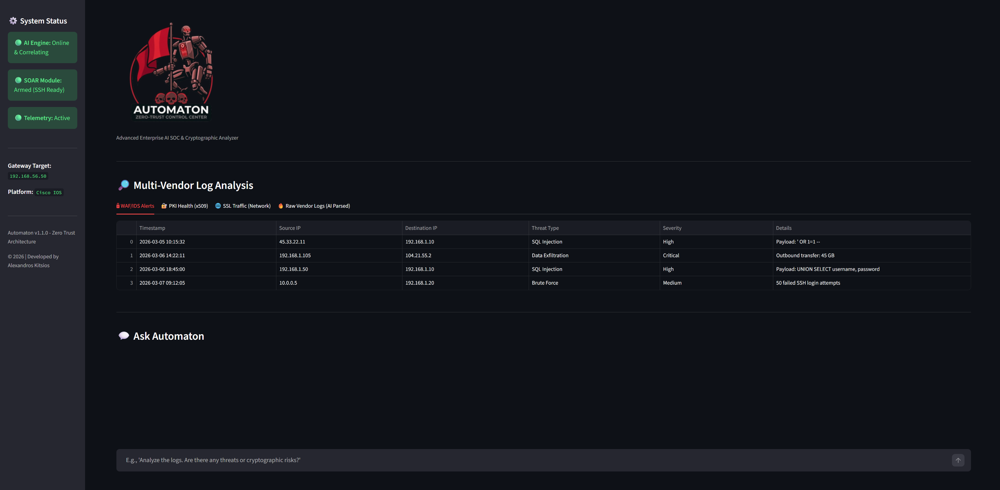

<p align="center">
  
</p>

Automaton is an advanced, AI-driven Security Orchestration, Automation, and Response (SOAR) platform designed for modern Enterprise SOCs. It seamlessly combines multi-vendor telemetry correlation with active, Zero-Trust network containment.

## Key Features
1. **Multi-Vendor Log Ingestion:** Parses and monitors WAF alerts, PKI/x509 health, SSL/TLS network traffic, and raw unstructured logs from FortiGate and Palo Alto.
2. **AI Correlation Engine:** Utilizes OpenAI's GPT models to act as a Tier-3 Incident Responder, instantly analyzing logs, identifying attack vectors (e.g., MITRE ATT&CK), and generating concise Incident Reports.
3. **Automated SOAR Execution:** Connects directly to network edge devices via SSH to dynamically enforce micro-segmentation (Targeted ACLs) or full interface isolation in real-time.

## Architecture & Philosophy
Automaton assumes breach. By leveraging Zero-Trust principles, the platform offers two distinct automated containment strategies depending on the severity of the incident:

1. **Surgical Threat Isolation (Recommended):** Deploys dynamic micro-segmentation (ACLs) to instantly cut off specific compromised assets at the core/edge level. This ensures the threat is neutralized while maintaining full business continuity for uncompromised hosts.
2. **Gateway Interface Shutdown (Last Resort):** Acts as the "nuclear option" for catastrophic, network-wide threats (e.g., rapid ransomware propagation). It administratively disables the physical edge interface via SSH, physically severing the network to prevent further lateral movement and data exfiltration.




---

## Installation & Execution Guide

### Prerequisites
* **Docker** (Recommended) OR **Python 3.10+**
* An **OpenAI API Key**. 
  *(Open `app.py` and replace `"API_KEY_HERE"` with your actual API key before running).*

### Option A: Run via Docker (Recommended)
1. **Clone the repository:**
   ```bash
   git clone <https://github.com/Alexkitsios/Automaton_AI_SOC.git>
   cd Automaton
   ```

2. **Build the Docker Image:**
   ```bash
   docker build -t automaton-app .
   ```

3. **Run the Container:**
   ```bash
   docker run -p 8501:8501 automaton-app
   ```

4. **Access the UI:** Open your browser and navigate to http://localhost:8501.

### Option B: Run locally via Python
1. **Install required dependencies:**
   ```bash
   pip install -r requirements.txt
   ```

2. **Launch the application:**
   ```bash
   streamlit run app.py
   ```

## ⚙️ SOAR Configuration: Running on Your Own Network
Automaton uses the netmiko Python library to send SSH commands to network devices. Out of the box, it is configured for a Cisco IOS Gateway at 192.168.56.50.

You can easily adapt Automaton to work with your own lab or production network, regardless of the vendor.

### Modifying the Target Device
1. Open `app.py` and locate the `cisco_device` dictionary inside the `execute_soar_action` function.
2. Update the dictionary with your own device's SSH credentials and IP address so Automaton can connect to it:

```python
cisco_device = {
    'device_type': 'cisco_ios',  # e.g., 'cisco_ios', 'paloalto_panos', 'fortinet'
    'host': '192.168.56.50',     # Your Gateway / Firewall IP Address
    'username': 'admin',         # Your SSH Username
    'password': 'YOUR_SSH_PASSWORD_HERE', # Your SSH Password
    ...
}
```

Note: Automaton supports almost any vendor via Netmiko. Examples for the `device_type` field:

- Cisco IOS: `'cisco_ios'`
- Palo Alto PAN-OS: `'paloalto_panos'`
- Fortinet FortiOS: `'fortinet'`
- Juniper Junos: `'juniper_junos'`

**Example for a Palo Alto Firewall:**
```python
target_device = {
    'device_type': 'paloalto_panos',
    'host': '10.0.0.1',  # Your Firewall IP
    'username': 'admin',
    'password': 'your_password',
}
```

### Modifying the Containment Playbooks (Commands)
If you change the vendor, you must also change the CLI commands Automaton sends. Inside `execute_soar_action`, modify the `config_commands` list.

**Example: Blocking an IP on a generic Linux IPTables Firewall instead of Cisco:**
```python
if action_type == 2:
    config_commands = [
        'iptables -A INPUT -s 10.0.0.2 -j DROP',
        'iptables-save'
    ]
```
